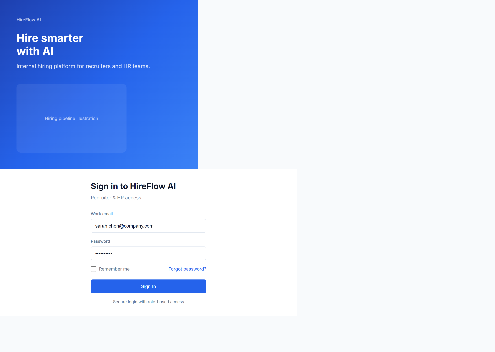
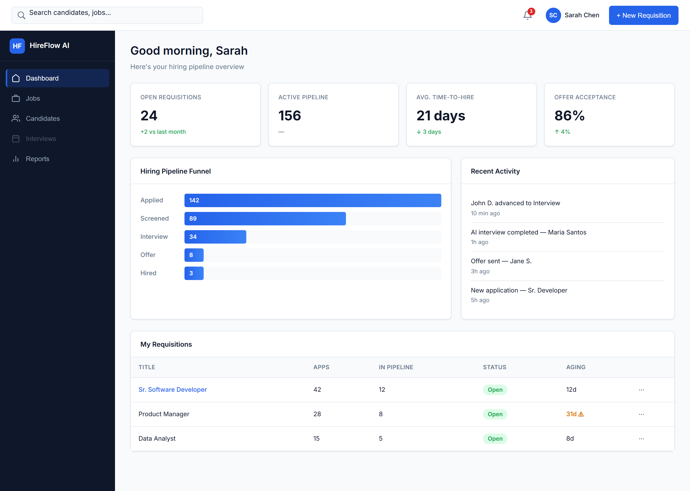
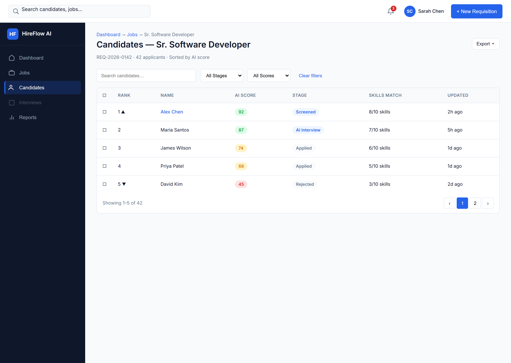
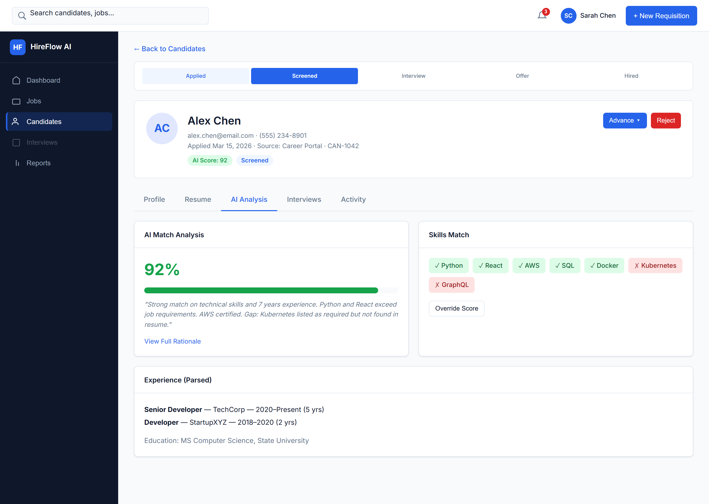
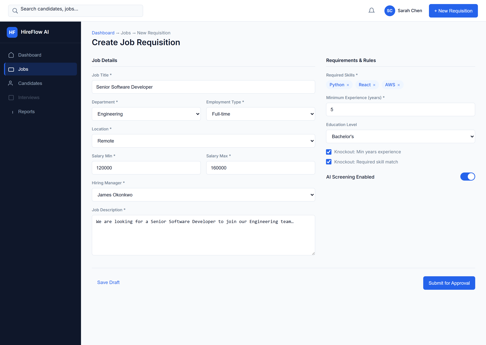
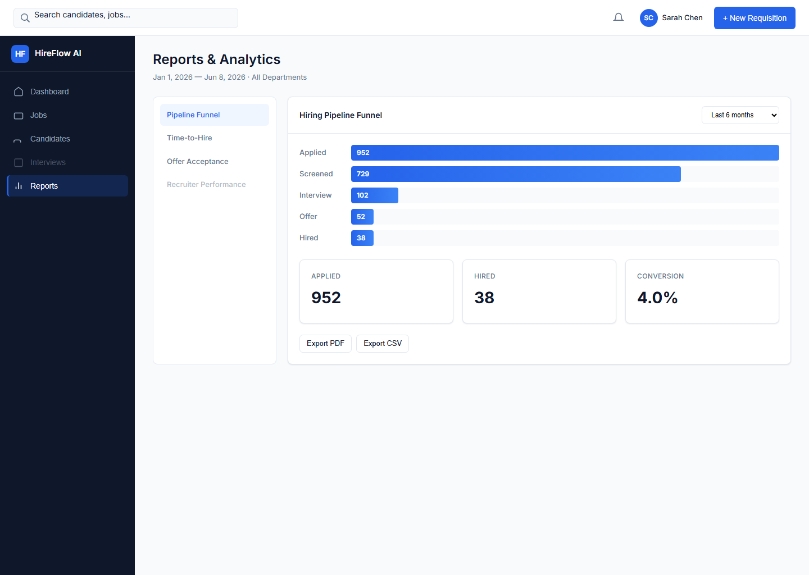
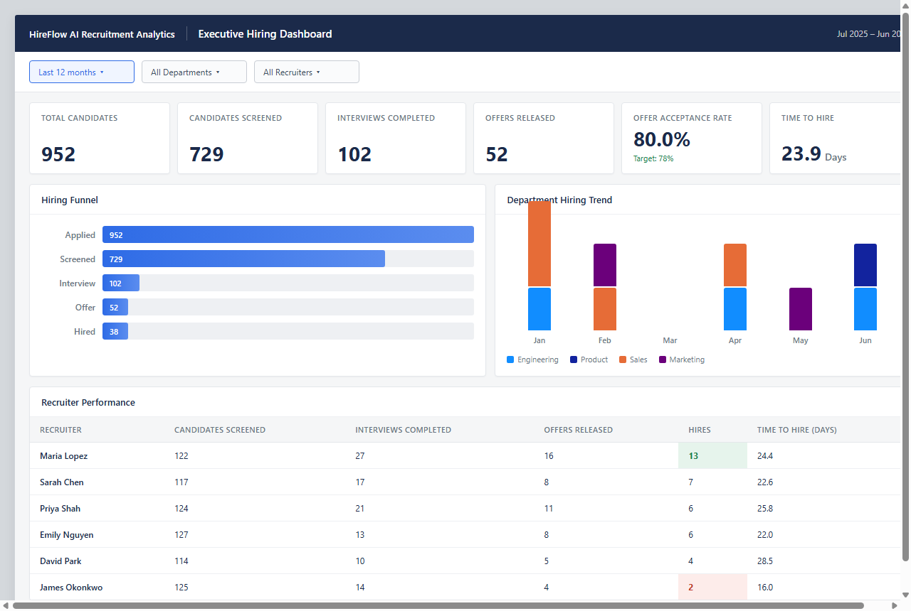

# HireFlow AI — Business Analyst Portfolio

**AI-Powered Recruitment Platform** | End-to-end BA case study

> Portfolio for **Junior Business Analyst** and **Associate Business Analyst** roles.  
> Shows how a BA moves from business problem → requirements → process → prototype → reporting → traceability.

---

## 1. Business Problem

Mid-market companies lose hiring speed and visibility when screening is manual, pipelines are opaque, and HR leaders lack funnel metrics. HireFlow AI is a case study documenting how an AI-assisted recruitment platform would address those gaps — from a **Business Analyst perspective**, not as a built product.

**Start here:** [01_Business_Context/Business_Case.md](01_Business_Context/Business_Case.md)

---

## 2. Stakeholders

Eight stakeholder groups (CHRO, HR Manager, Recruiters, Hiring Managers, Compliance, IT, Finance, Candidates) with mapped pain points, goals, and influence.

**Artifact:** [02_Stakeholder_Analysis/Stakeholder_Matrix.md](02_Stakeholder_Analysis/Stakeholder_Matrix.md)

---

## 3. Requirements

Business requirements captured in a structured BRD — scope, functional needs, reporting needs, and business rules for AI-assisted hiring.

**Artifact:** [03_Business_Requirements/BRD.md](03_Business_Requirements/BRD.md)

---

## 4. Process Improvement

AS-IS vs TO-BE hiring workflows: requisition, AI screening, interview scheduling, evaluation, and offer.

**Artifact:** [04_Process_Modeling/Process_Flows.md](04_Process_Modeling/Process_Flows.md)

---

## 5. User Stories

Agile backlog with acceptance criteria in Gherkin format — testable requirements tied to personas.

| Artifact | Location |
|----------|----------|
| User Stories | [05_User_Stories_and_Acceptance/User_Stories.md](05_User_Stories_and_Acceptance/User_Stories.md) |
| Acceptance Criteria | [05_User_Stories_and_Acceptance/Acceptance_Criteria.md](05_User_Stories_and_Acceptance/Acceptance_Criteria.md) |

---

## 6. Figma Prototype

Wireframes and a six-screen prototype story showing how requirements become recruiter and HR workflows.

| Artifact | Location |
|----------|----------|
| Wireframes | [07_UX_Prototype/Wireframes.md](07_UX_Prototype/Wireframes.md) |
| Build plan | [07_UX_Prototype/Figma_Implementation_Package.md](07_UX_Prototype/Figma_Implementation_Package.md) |
| Demo script | [07_UX_Prototype/Prototype_Demo_Guide.md](07_UX_Prototype/Prototype_Demo_Guide.md) |

**Screenshots:**

| Screen | Preview |
|--------|---------|
| Login |  |
| Recruiter Dashboard |  |
| Candidate List |  |
| Candidate Details |  |
| Job Requisition |  |
| Reports Dashboard |  |

---

## 7. Dashboard

Executive Hiring Dashboard — one page for CHRO and HR leadership answering: *Are we hiring efficiently and moving candidates through the funnel successfully?*

| Artifact | Location |
|----------|----------|
| Dashboard requirements | [08_Data_and_Reporting/Dashboard_Overview.md](08_Data_and_Reporting/Dashboard_Overview.md) |
| KPI definitions | [08_Data_and_Reporting/KPI_Definitions.md](08_Data_and_Reporting/KPI_Definitions.md) |
| Reporting requirements | [08_Data_and_Reporting/Reporting_Requirements.md](08_Data_and_Reporting/Reporting_Requirements.md) |



**Verified metrics (12-month period):** 952 applications · 729 screened · 102 interviews · 52 offers · 38 hires · 23.9-day time-to-hire · 80% offer acceptance

---

## 8. Traceability

Requirements Traceability Matrix linking business needs → user stories → validation.

**Artifact:** [06_Traceability_and_Validation/RTM.md](06_Traceability_and_Validation/RTM.md)

**Supporting validation examples:**

| Artifact | Location |
|----------|----------|
| Business SQL examples | [08_Data_and_Reporting/Business_SQL_Examples.md](08_Data_and_Reporting/Business_SQL_Examples.md) |
| API analysis (summary) | [08_Data_and_Reporting/API_Analysis.md](08_Data_and_Reporting/API_Analysis.md) |
| Data model (conceptual) | [08_Data_and_Reporting/Data_Model.md](08_Data_and_Reporting/Data_Model.md) |

---

## 9. Business Outcomes

| Outcome | How the portfolio demonstrates it |
|---------|-------------------------------------|
| Faster screening | TO-BE process + AI-ranked candidate list prototype |
| Pipeline visibility | Recruiter dashboard + executive hiring dashboard |
| Explainable AI decisions | Candidate details screen with score rationale |
| Measurable hiring health | KPI definitions + reporting requirements |
| Governed requirements | RTM from stakeholder need to acceptance criteria |

---

## 10-Minute Interview Path

| Step | Topic | File |
|------|-------|------|
| 1 | Business Case | [01_Business_Context/Business_Case.md](01_Business_Context/Business_Case.md) |
| 2 | Stakeholder Analysis | [02_Stakeholder_Analysis/Stakeholder_Matrix.md](02_Stakeholder_Analysis/Stakeholder_Matrix.md) |
| 3 | BRD | [03_Business_Requirements/BRD.md](03_Business_Requirements/BRD.md) |
| 4 | Process Flow | [04_Process_Modeling/Process_Flows.md](04_Process_Modeling/Process_Flows.md) |
| 5 | User Stories | [05_User_Stories_and_Acceptance/User_Stories.md](05_User_Stories_and_Acceptance/User_Stories.md) |
| 6 | Figma Screens | [assets/screenshots/](assets/screenshots/) + [Prototype_Demo_Guide.md](07_UX_Prototype/Prototype_Demo_Guide.md) |
| 7 | Dashboard | [assets/dashboard/executive-hiring-dashboard.png](assets/dashboard/executive-hiring-dashboard.png) |
| 8 | RTM | [06_Traceability_and_Validation/RTM.md](06_Traceability_and_Validation/RTM.md) |
| 9 | Presentation | [09_Interview_Portfolio/Presentation_Deck.md](09_Interview_Portfolio/Presentation_Deck.md) |

**Full script:** [09_Interview_Portfolio/Interview_Walkthrough.md](09_Interview_Portfolio/Interview_Walkthrough.md)  
**Resume bullets:** [09_Interview_Portfolio/Resume_Project_Section.md](09_Interview_Portfolio/Resume_Project_Section.md)

---

## Repository Structure

```
01_Business_Context/           Business case
02_Stakeholder_Analysis/       Stakeholder matrix
03_Business_Requirements/      BRD
04_Process_Modeling/           AS-IS / TO-BE flows
05_User_Stories_and_Acceptance/  Stories + acceptance criteria
06_Traceability_and_Validation/  RTM
07_UX_Prototype/               Wireframes, Figma plan, demo guide
08_Data_and_Reporting/         Data model, KPIs, reporting, SQL & API summaries
09_Interview_Portfolio/        Presentation, walkthrough, resume section
assets/                        Prototype screenshots + dashboard image
```

---

## What This Is — and Is Not

| This portfolio shows | This portfolio does not lead with |
|----------------------|-----------------------------------|
| Elicitation and stakeholder analysis | Solution architecture |
| BRD and user story specification | Database administration |
| Process modeling and improvement | BI development / DAX engineering |
| Wireframes and reporting requirements | QA test automation |
| Traceability and validation thinking | Project management governance |

This repository contains **interview-ready BA artifacts only** — business case through traceability, prototype screenshots, and dashboard preview. No production code or engineering build files.

---

**Author:** Rohit | Business Analyst Portfolio  
**Repository:** [github.com/kumarrohit50404/AI-Recruitment-Platform-BA](https://github.com/kumarrohit50404/AI-Recruitment-Platform-BA)  
**Version:** 4.0 | June 2026
